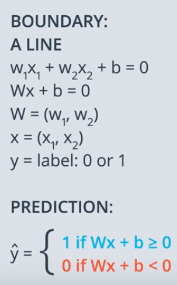

# Classification

**When we have a system for acceptance of students at a university and most people who get 9 in test and 8 in grades more likely to get accepted but who get 3 in test and 4 in grades are more likely not to be accepted, so I we have a student who gets 7 in test and 6 in grades, will he be accepted or not?**

    

**we could say from the data above that the student will be accepted because he falls at the area of accepted students. We can clarify it more by setting a line which seperates the students who got accepted or not accepted like below**

    

 
 
 
 

**that line which has been drawn it has an equation  which mean to accept or reject a student we should see the equation result  and the result if it > 0 the student will be accepted and if it < 0 the student will be rejected**

 
 
 
 

 
 
 
 

**In more general case the equation of the boundary line will be  and to summarize it more, we will have  which  is a vector of  and  is a vector of  and   is a label of 0 or 1**