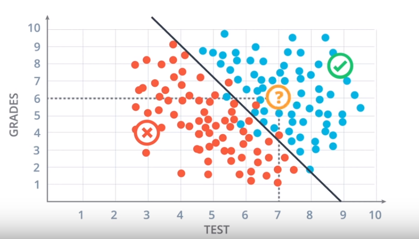
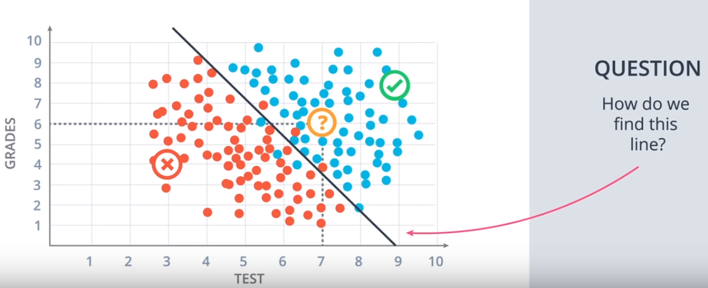
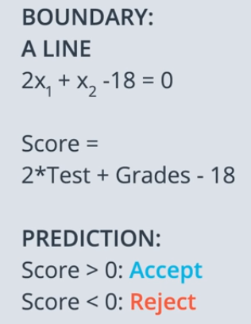
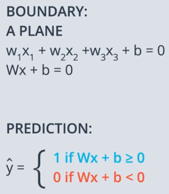
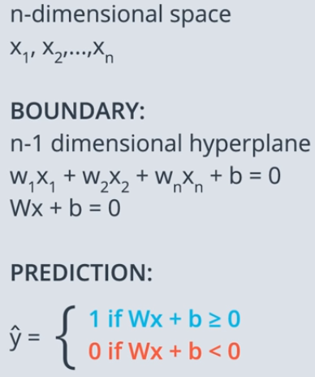

# Introduction to Neural Networks

## Table of Contents

* [3.1 Introduction](#3.1-intorduction)
* [3.2 Classification Problems 1](#3.2-classification-problems-1)
* [3.3 Classification Problems 2](#3.3-classification-problems-2)
* [3.4 Linear Boundaries](#3.4-linear-boundaries)
* [3.5 Higher Dimensions](#3.5-higher-dimensions)
---

## 3.1 Introduction

* ### **What is Deep Learning?, What is it used for?**
    - #### Deep Learning is subfield of machine learning concerned with algorithms inspired by the structure and function of the brain called Artificail Neural Networks.
    - #### It has many applications such as:
        - beating Humans in games such as Go or jeopardy
        - Detecting spam in emails
        - forcasting stock prices
        - recognizig images in pictures
        - diagnosing illnesses sometimes with more percision than doctors
        - self-driving cars

* ### **Neural Networks**
    - It vaguely mimic the process of how the brain operates, with neurons that fire bits of information.

## 3.2 Classification Problems 1

**When we have a system for acceptance of students at a university and most people who get 9 in test and 8 in grades more likely to get accepted but who get 3 in test and 4 in grades are more likely not to be accepted, so If we have a student who gets 7 in test and 6 in grades, will he be accepted or not?**

    

## 3.3 Classification Problems 2

**we could say from the data above that the student will be accepted because he falls at the area of accepted students. We can clarify it more by setting a line which seperates the students who got accepted or not accepted like below**

    

 

## 3.4 Linear Boundaries

    

 
 

**that line which has been drawn it has an equation  which mean to accept or reject a student we should see the equation result  and the result if it > 0 the student will be accepted and if it < 0 the student will be rejected**

 
 
 
 

 
 

**In more general case the equation of the boundary line will be  and to summarize it more, we will have  which  is a vector of  and  is a vector of  and   is a label of 0 or 1. The prediction variable  which will be 1 if  which will be above the line and will be 0 if  which will be below the line.**

 

## 3.5 Higher Dimensions

**If we have 3 columns instead of 2, we won't be working in 2 dimensions, we will be working in three dimensions**

    

 

**The Equation for that plane will be  but it still could be abreviated with  but instead the vector  will include  and the vector  will include  and the predction will still **

 

**But what if we have n dimensional space , We will have n dimensional hyperplane and the equation will be  but it still could be abreviated with  but instead the vector  will include  and the vector  will include  and the predction will still **