# Introduction to Neural Networks

## Table of Contents

* [3.1 Introduction](#3.1-intorduction)
* [3.2 Classification Problems 1](#3.2-classification-problems-1)
* [3.3 Classification Problems 2](#3.3-classification-problems-2)
* [3.4 Linear Boundaries](#3.4-linear-boundaries)
* [3.5 Higher Dimensions](#3.5-higher-dimensions)
* [3.6 Perceptrons](#3.6-perceptrons)
* [3.7 Why Neural Networks?](#3.7-why-neural-networks?)
* [3.8 Perceptrons as Logical Operators](#3.8-perceptrons-as-logical-operators)
* [3.9 Perceptron Trick](#3.9-perceptron-trick)
* [3.10 Perceptron Algorithm](#3.10-perceptron-algorithm)
* [3.11 Non Linear Regions](#3.11-non-linear-regions)
* [3.12 Error Functions](#3.12-error-functions)
* [3.13 Log-loss Error Function](#3.13-log-loss-error-function)
* [3.14 Discrete vs Continous](#3.14-discrete-vs-continous)
---

## 3.1 Introduction

* ### **What is Deep Learning?, What is it used for?**
    - #### Deep Learning is subfield of machine learning concerned with algorithms inspired by the structure and function of the brain called Artificail Neural Networks.
    - #### It has many applications such as:
        - beating Humans in games such as Go or jeopardy
        - Detecting spam in emails
        - forcasting stock prices
        - recognizig images in pictures
        - diagnosing illnesses sometimes with more percision than doctors
        - self-driving cars


* ### **Neural Networks**
    - It vaguely mimic the process of how the brain operates, with neurons that fire bits of information.

## 3.2 Classification Problems 1

**When we have a system for acceptance of students at a university and most people who get 9 in test and 8 in grades more likely to get accepted but who get 3 in test and 4 in grades are more likely not to be accepted, so If we have a student who gets 7 in test and 6 in grades, will he be accepted or not?**

<p align="center">
    
</p>

## 3.3 Classification Problems 2

**we could say from the data above that the student will be accepted because he falls at the area of accepted students. We can clarify it more by setting a line which seperates the students who got accepted or not accepted like below**

<p align="center">
    
</p>

<br>

## 3.4 Linear Boundaries

<p align="center">
    
</p>


<br>
<br>

**that line which has been drawn it has an equation <a href="https://www.codecogs.com/eqnedit.php?latex=2x_{1}&space;&plus;&space;x_{2}&space;-&space;18&space;=&space;0" target="_blank"></a> which mean to accept or reject a student we should see the equation result <a href="https://www.codecogs.com/eqnedit.php?latex=2*test&space;&plus;&space;grades&space;-&space;18&space;=&space;0" target="_blank"></a> and the result if it > 0 the student will be accepted and if it < 0 the student will be rejected**

<br>
<br>
<br>
<br>


<br>
<br>

**In more general case the equation of the boundary line will be <a href="https://www.codecogs.com/eqnedit.php?latex=w_{1}x_{1}&space;&plus;&space;w_{2}x_{2}&space;&plus;&space;b&space;=&space;0" target="_blank"></a> and to summarize it more, we will have <a href="https://www.codecogs.com/eqnedit.php?latex=WX&space;&plus;&space;b&space;=&space;0" target="_blank"></a> which <a href="https://www.codecogs.com/eqnedit.php?latex=W" target="_blank"></a> is a vector of <a href="https://www.codecogs.com/eqnedit.php?latex=w_{1},&space;w_{2}" target="_blank"></a> and <a href="https://www.codecogs.com/eqnedit.php?latex=X" target="_blank"></a> is a vector of <a href="https://www.codecogs.com/eqnedit.php?latex=x_{1},&space;x_{2}" target="_blank"></a> and  <a href="https://www.codecogs.com/eqnedit.php?latex=y" target="_blank"></a> is a label of 0 or 1. The prediction variable <a href="https://www.codecogs.com/eqnedit.php?latex=y\hat{}" target="_blank"></a> which will be 1 if <a href="https://www.codecogs.com/eqnedit.php?latex=WX&space;&plus;&space;b&space;\geq&space;0" target="_blank"></a> which will be above the line and will be 0 if <a href="https://www.codecogs.com/eqnedit.php?latex=WX&space;&plus;&space;b&space;<&space;0" target="_blank"></a> which will be below the line.**

<br>

## 3.5 Higher Dimensions

**If we have 3 columns instead of 2, we won't be working in 2 dimensions, we will be working in three dimensions**

<p align="center">
    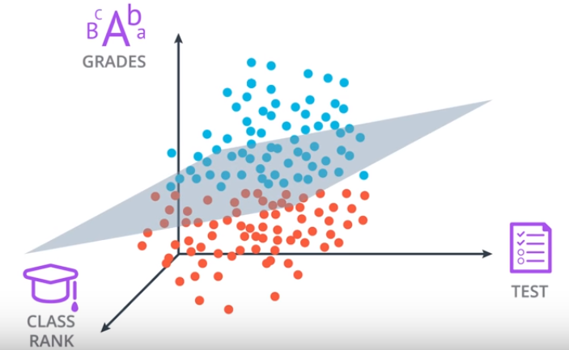
</p>


<br>

**The Equation for that plane will be <a href="https://www.codecogs.com/eqnedit.php?latex=w_{1}x_{1}&space;&plus;&space;w_{2}x_{2}&space;&plus;&space;w_{3}x_{3}&space;&plus;&space;b&space;=&space;0" target="_blank"></a> but it still could be abreviated with <a href="https://www.codecogs.com/eqnedit.php?latex=WX&space;&plus;&space;b&space;=&space;0" target="_blank"></a> but instead the vector <a href="https://www.codecogs.com/eqnedit.php?latex=\vec{W}" target="_blank"></a> will include <a href="https://www.codecogs.com/eqnedit.php?latex=w_{1},&space;w_{2},&space;w_{3}" target="_blank"></a> and the vector <a href="https://www.codecogs.com/eqnedit.php?latex=\vec{X}" target="_blank"></a> will include <a href="https://www.codecogs.com/eqnedit.php?latex=x_{1},&space;x_{2},&space;x_{3}" target="_blank"></a> and the predction will still <a href="https://www.codecogs.com/eqnedit.php?latex=\hat{y}\begin{cases}&space;&&space;1&space;\text{&space;if&space;}&space;WX&space;&plus;&space;b&space;\geq&space;0&space;\\&space;&&space;0&space;\text{&space;if&space;}&space;WX&space;&plus;&space;b&space;<&space;0&space;\end{cases}" target="_blank"></a>**

<br>


**But what if we have n dimensional space <a href="https://www.codecogs.com/eqnedit.php?latex=x_{1},&space;x_{2},....,&space;x_{n}" target="_blank"></a>, We will have n dimensional hyperplane and the equation will be <a href="https://www.codecogs.com/eqnedit.php?latex=w_{1}x_{1}&space;&plus;&space;w_{2}x_{2}&space;&plus;&space;w_{3}x_{3}&space;&plus;&space;b&space;=&space;0" target="_blank"></a> but it still could be abreviated with <a href="https://www.codecogs.com/eqnedit.php?latex=WX&space;&plus;&space;b&space;=&space;0" target="_blank"></a> but instead the vector <a href="https://www.codecogs.com/eqnedit.php?latex=\vec{W}" target="_blank"></a> will include <a href="https://www.codecogs.com/eqnedit.php?latex=w_{1},&space;w_{2},....,&space;w_{n}" target="_blank"></a> and the vector <a href="https://www.codecogs.com/eqnedit.php?latex=\vec{X}" target="_blank"></a> will include <a href="https://www.codecogs.com/eqnedit.php?latex=x_{1},&space;x_{2},....,&space;x_{n}" target="_blank"></a> and the predction will still <a href="https://www.codecogs.com/eqnedit.php?latex=\hat{y}\begin{cases}&space;&&space;1&space;\text{&space;if&space;}&space;WX&space;&plus;&space;b&space;\geq&space;0&space;\\&space;&&space;0&space;\text{&space;if&space;}&space;WX&space;&plus;&space;b&space;<&space;0&space;\end{cases}" target="_blank"></a>**

## 3.6 Perceptrons

**It's a neural network unit which make some computations on the data to extract features from it**

<p align="center">
    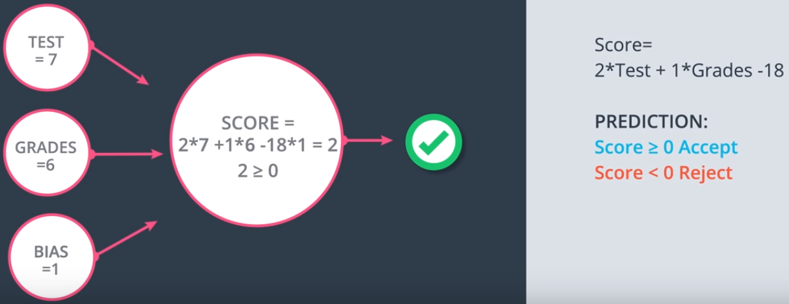
</p>

**As we see in the above graph, we input the data to the perceptron unit to evaluate the inputs and classify if it belongs to accepted or rejected area and we use the score fuction <a href="https://www.codecogs.com/eqnedit.php?latex=2*Test&space;&plus;&space;1*Grades&space;-&space;18" target="_blank"></a> to determine that if <a href="https://www.codecogs.com/eqnedit.php?latex=Score&space;\geq&space;0&space;Accepted" target="_blank"></a> Accepted and if <a href="https://www.codecogs.com/eqnedit.php?latex=Score&space;<&space;0&space;Rejected" target="_blank"></a> Rejected.**


**But in the General Case the node will have an input values <a href="https://www.codecogs.com/eqnedit.php?latex=x_{1},&space;x_{2},....,&space;x_{n}" target="_blank"></a> and 1 and edges with wieghts <a href="https://www.codecogs.com/eqnedit.php?latex=w_{1},&space;w_{2},....,&space;w_{n}" target="_blank"></a> and b corresponding for bais unit then the node will calculate the linear euqation <a href="https://www.codecogs.com/eqnedit.php?latex=WX&space;&plus;&space;b&space;=&space;\sum_{i=1}^{n}&space;W_{i}X_{i}&space;&plus;&space;b" target="_blank"></a> then it checks if <a href="https://www.codecogs.com/eqnedit.php?latex=WX&space;&plus;&space;b&space;\geq&space;0" target="_blank"></a> if it is, then the node returns a value of one for yes and if not then it returns a value of zero for no.**

<p align="center">
    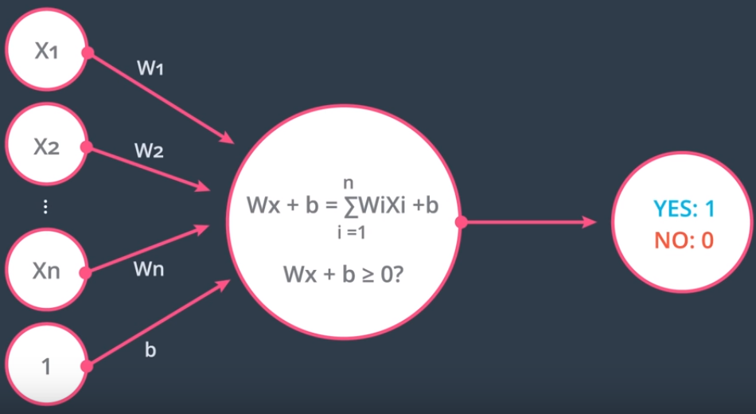
</p>

**The step of evaluation whether it 's 0 or 1, It's called "Step Function" which returns <a href="https://www.codecogs.com/eqnedit.php?latex=y&space;=&space;\begin{cases}&space;&&space;1&space;\text{&space;if&space;}&space;x&space;\geq&space;0&space;\\&space;&&space;0&space;\text{&space;if&space;}&space;x&space;<&space;0&space;\end{cases}" target="_blank"></a>, so we could say that those perceptrons are a combination of nodes the first one as a "Linear Function" and the second on is a "Step Function"**

<p align="center">
    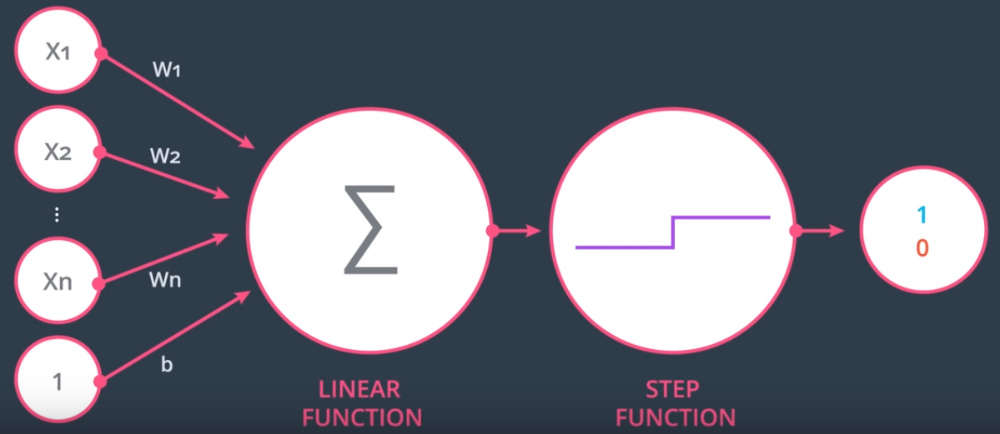
</p>

## 3.7 Why Neural Networks?

<p align="center">
    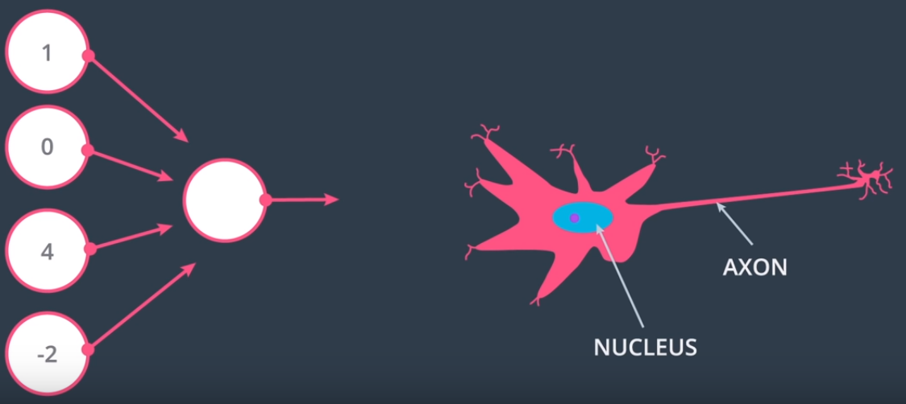
</p>

**The reason why these objects called neural networks because perceptions kind of look like neurons in the brain.**

<p align="center">
    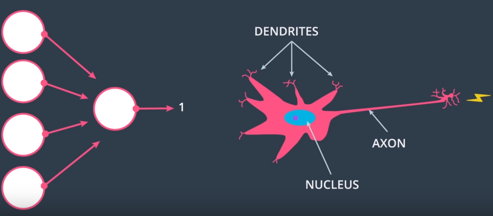
</p>

**The percptron get the data inputs and does some calculations on them to output 0 ot 1, just as neurons get the impulses through dendrites and do something to it and then decides if it outputs a nervous impulse or not through axon**

## 3.8 Perceptrons as Logical Operators

- ### AND Perceptron

    - **It takes 2 inputs and evaluates to true when the 2 inputs are True and To apply these into perceptron we draw a table of zeros and ones where negative area corresponds to red and positive to blue and it evaluates to 1 when the two inputs are 1**

<p align="center">
    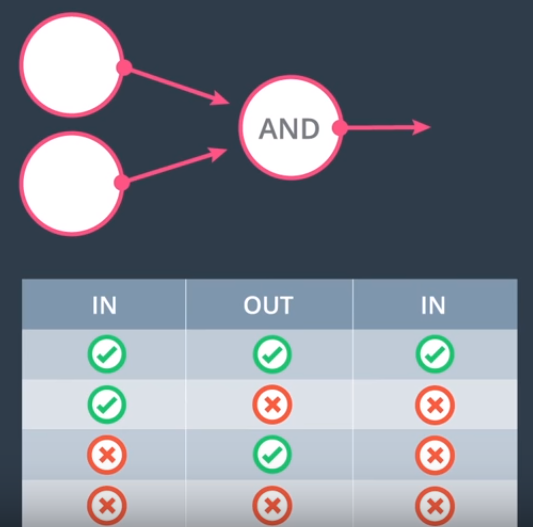
    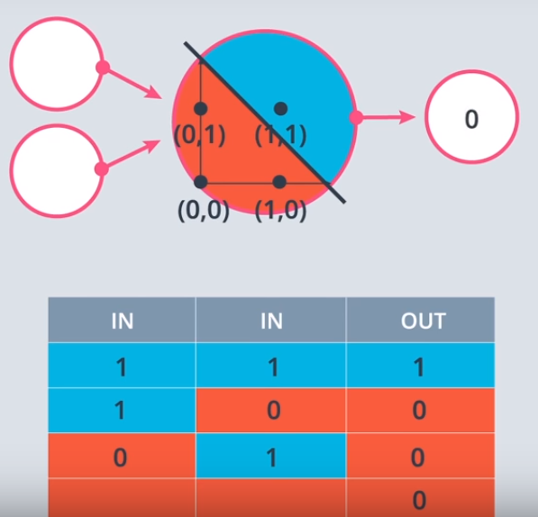
</p>

```python
import pandas as pd

# TODO: Set weight1, weight2, and bias
weight1 = 1.0
weight2 = 1.0
bias = -2.0


# DON'T CHANGE ANYTHING BELOW
# Inputs and outputs
test_inputs = [(0, 0), (0, 1), (1, 0), (1, 1)]
correct_outputs = [False, False, False, True]
outputs = []

# Generate and check output
for test_input, correct_output in zip(test_inputs, correct_outputs):
    linear_combination = weight1 * test_input[0] + weight2 * test_input[1] + bias
    output = int(linear_combination >= 0)
    is_correct_string = 'Yes' if output == correct_output else 'No'
    outputs.append([test_input[0], test_input[1], linear_combination, output, is_correct_string])

# Print output
num_wrong = len([output[4] for output in outputs if output[4] == 'No'])
output_frame = pd.DataFrame(outputs, columns=['Input 1', '  Input 2', '  Linear Combination', '  Activation Output', '  Is Correct'])
if not num_wrong:
    print('Nice!  You got it all correct.\n')
else:
    print('You got {} wrong.  Keep trying!\n'.format(num_wrong))
print(output_frame.to_string(index=False))
```

```python
Nice!  You got it all correct.

Input 1    Input 2    Linear Combination    Activation Output   Is Correct
      0          0                  -2.0                    0          Yes
      0          1                  -1.0                    0          Yes
      1          0                  -1.0                    0          Yes
      1          1                   0.0                    1          Yes
```

- ### OR Perceptron

    - **It takes 2 inputs and evaluates to True when one of the inputs is True and To apply these into perceptron we draw a table of zeros and ones where negative area corresponds to red and positive to blue and it evaluates to 1 when the one of inputs are 1**

<p align="center">
    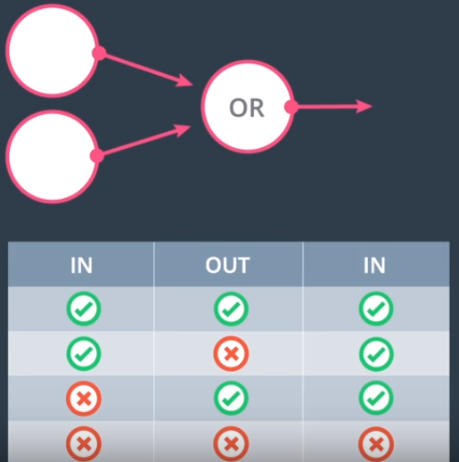
    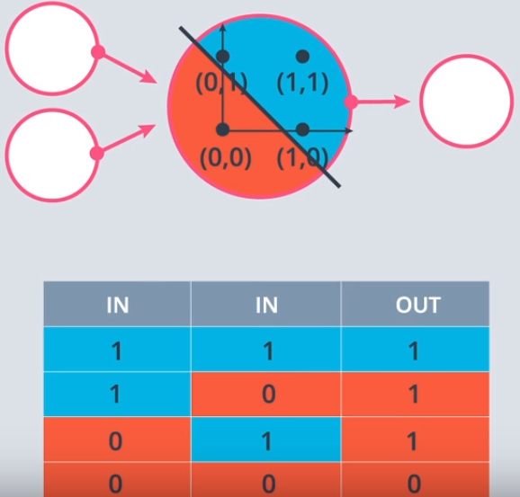
</p>

```python
import pandas as pd

# TODO: Set weight1, weight2, and bias
weight1 = 2.0
weight2 = 2.0
bias = -1.0


# DON'T CHANGE ANYTHING BELOW
# Inputs and outputs
test_inputs = [(0, 0), (0, 1), (1, 0), (1, 1)]
correct_outputs = [False, False, False, True]
outputs = []

# Generate and check output
for test_input, correct_output in zip(test_inputs, correct_outputs):
    linear_combination = weight1 * test_input[0] + weight2 * test_input[1] + bias
    output = int(linear_combination >= 0)
    is_correct_string = 'Yes' if output == correct_output else 'No'
    outputs.append([test_input[0], test_input[1], linear_combination, output, is_correct_string])

# Print output
num_wrong = len([output[4] for output in outputs if output[4] == 'No'])
output_frame = pd.DataFrame(outputs, columns=['Input 1', '  Input 2', '  Linear Combination', '  Activation Output', '  Is Correct'])
if not num_wrong:
    print('Nice!  You got it all correct.\n')
else:
    print('You got {} wrong.  Keep trying!\n'.format(num_wrong))
print(output_frame.to_string(index=False))
```

```python
Nice!  You got it all correct.

Input 1    Input 2    Linear Combination    Activation Output   Is Correct
      0          0                  -1.0                    0          Yes
      0          1                   1.0                    1          Yes
      1          0                   1.0                    1          Yes
      1          1                   3.0                    1          Yes
```

- ### NOT Perceptron

    - **Unlike other operators we looked at, the NOT operation only cares about one input. the operation returns a 0 if the input is 1 and a 1 if the input is 0. The other inputs to perceptron are ignored**

```python
import pandas as pd

# TODO: Set weight1, weight2, and bias
weight1 = 1.0
weight2 = -2.0
bias = 0.0


# DON'T CHANGE ANYTHING BELOW
# Inputs and outputs
test_inputs = [(0, 0), (0, 1), (1, 0), (1, 1)]
correct_outputs = [True, False, True, False]
outputs = []

# Generate and check output
for test_input, correct_output in zip(test_inputs, correct_outputs):
    linear_combination = weight1 * test_input[0] + weight2 * test_input[1] + bias
    output = int(linear_combination >= 0)
    is_correct_string = 'Yes' if output == correct_output else 'No'
    outputs.append([test_input[0], test_input[1], linear_combination, output, is_correct_string])

# Print output
num_wrong = len([output[4] for output in outputs if output[4] == 'No'])
output_frame = pd.DataFrame(outputs, columns=['Input 1', '  Input 2', '  Linear Combination', '  Activation Output', '  Is Correct'])
if not num_wrong:
    print('Nice!  You got it all correct.\n')
else:
    print('You got {} wrong.  Keep trying!\n'.format(num_wrong))
print(output_frame.to_string(index=False))
```

```python
Nice!  You got it all correct.

Input 1    Input 2    Linear Combination    Activation Output   Is Correct
      0          0                   0.0                    1          Yes
      0          1                  -2.0                    0          Yes
      1          0                   1.0                    1          Yes
      1          1                  -1.0                    0          Yes
```

- ### XOR Perceptron

    - **It's a multilayer perceptron which takes 2 inputs to the first layer which consists of AND, NOT and OR then feed the results to AND perceptron to get XOR perceptron.**

<p align="center">
    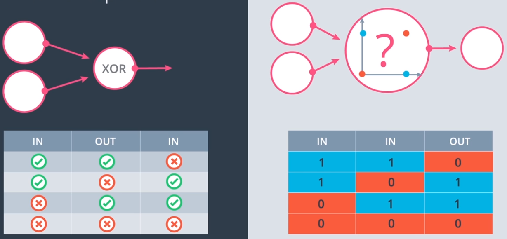
    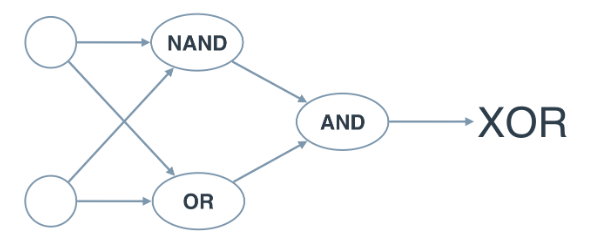
</p>

## 3.9 Perceptron Trick

<p align="center">
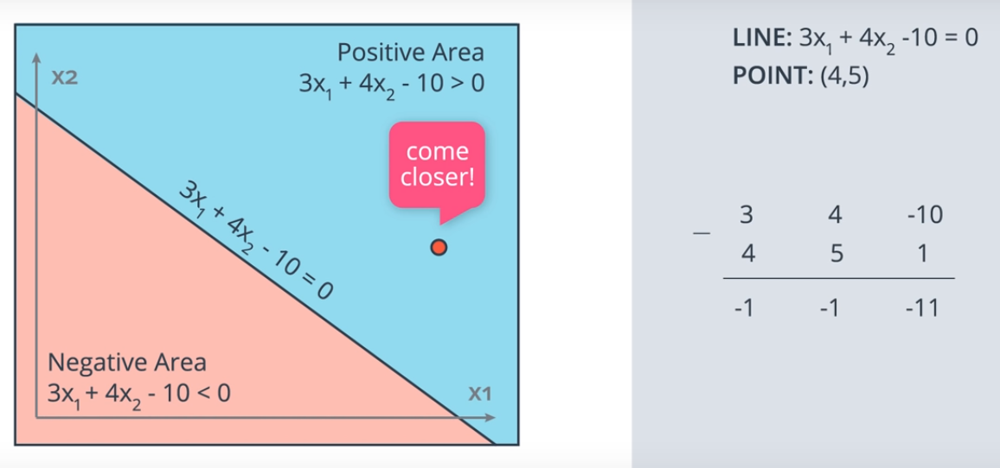
</p>

**If we have a line with function <a href="https://www.codecogs.com/eqnedit.php?latex=2.6x_{1}&space;&plus;&space;4x_{2}&space;-&space;10&space;=&space;0" target="_blank"></a> and a point in coordinates <a href="https://www.codecogs.com/eqnedit.php?latex=(4,5)" target="_blank"></a> and the point in the positive area which is misclassified and should be in the negative area, so we need to make the line near from the point without misclassified the other points, if <a href="https://www.codecogs.com/eqnedit.php?latex=\begin{matrix}&space;3&space;&&space;4&space;&&space;-10\\&space;-&space;&&space;&&space;\\&space;4&space;&&space;5&space;&&space;1&space;\end{matrix}" target="_blank"></a> we will have <a href="https://www.codecogs.com/eqnedit.php?latex=\begin{matrix}&space;-1&space;&&space;-1&space;&&space;-11&space;\end{matrix}" target="_blank"></a> which will make the line shift aggressively and we could misclassify the other points, so we could use what's called learning rate (0.1) which will help the line move short steps towards the point <a href="https://www.codecogs.com/eqnedit.php?latex=\begin{matrix}&space;3&space;&&space;4&space;&&space;-10\\&space;-&space;&&space;&&space;\\&space;4*0.1&space;&&space;5*0.1&space;&&space;1*0.1&space;\end{matrix}" target="_blank"></a> and we will get a new line <a href="https://www.codecogs.com/eqnedit.php?latex=2.6x_{1}&space;&plus;&space;3.5x_{2}&space;-&space;10.1&space;=&space;0" target="_blank"></a> and we do the same steps if the point was in the negative area but we will add the points not subtract them.**

<p align="center">
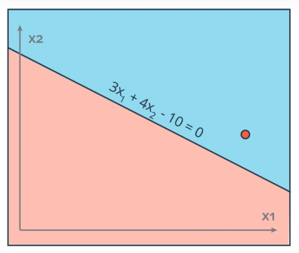
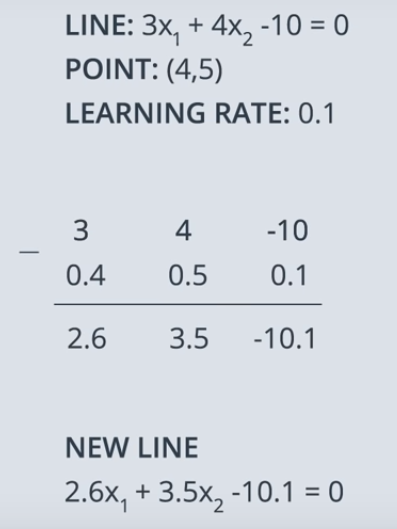
</p>

## 3.10 Perceptron Algorithm

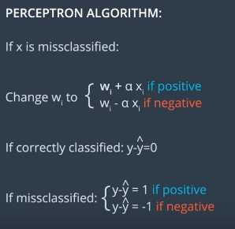

```python
1. Start with random weights: w1,..., wn, b
2. For Every misclassified point(x1,...., xn):
    2.1 If the prediction = 0
        - For i = 1...n
            - change w_i + alpha*x_i
        change b to b + alpha

    2.2 If the prediction = 1
        - For i = 1....n
            -change w_i - alpha*x_i
        -change b to b - alpha
```

```python
import numpy as np
# Setting the random seed, feel free to change it and see different solutions.
np.random.seed(42)

def stepFunction(t):
    if t >= 0:
        return 1
    return 0

def prediction(X, W, b):
    return stepFunction((np.matmul(X,W)+b)[0])

# TODO: Fill in the code below to implement the perceptron trick.
# The function should receive as inputs the data X, the labels y,
# the weights W (as an array), and the bias b,
# update the weights and bias W, b, according to the perceptron algorithm,
# and return W and b.
def perceptronStep(X, y, W, b, learn_rate = 0.01):
    # Fill in code
    for i in range(len(X)):
        y_hat = prediction(X[i], W, b)

        if y[i]-y_hat == 1:
            W[0] += X[i][0] * learn_rate
            W[1] += X[i][1] * learn_rate
            b += learn_rate

        elif y[i]-y_hat == -1:
            W[0] -= X[i][0] * learn_rate
            W[1] -= X[i][1] * learn_rate
            b -= learn_rate

    return W, b

# This function runs the perceptron algorithm repeatedly on the dataset,
# and returns a few of the boundary lines obtained in the iterations,
# for plotting purposes.
# Feel free to play with the learning rate and the num_epochs,
# and see your results plotted below.
def trainPerceptronAlgorithm(X, y, learn_rate = 0.01, num_epochs = 25):
    x_min, x_max = min(X.T[0]), max(X.T[0])
    y_min, y_max = min(X.T[1]), max(X.T[1])
    W = np.array(np.random.rand(2,1))
    b = np.random.rand(1)[0] + x_max
    # These are the solution lines that get plotted below.
    boundary_lines = []
    for i in range(num_epochs):
        # In each epoch, we apply the perceptron step.
        W, b = perceptronStep(X, y, W, b, learn_rate)
        boundary_lines.append((-W[0]/W[1], -b/W[1]))

    return boundary_lines
```

## 3.11 Non Linear Regions

**Let's say that we have a student who get 9 on test and 1 on grades that mean according to that model he should be in the accepted area.**

<p align="center">
    
</p>

**But that's wont be reasonable because he should what ever he got in the test if the grade is low, he should,'t be accepted, so the data should be more like that**

<p align="center">
    
</p>

**But now the data cannot be separated by a line, we need more complexity to fit that data. we might fit the data with the curve and that's mean the perceptron algorithm won't work this time and we need to redefine our perceptron algorithm in away that it will generalize to other types of curves**

<p align="center">
    
</p>

## 3.12 Error Functions

**The Error function is used to decrease the distance between function and the target**

<p align="center">
    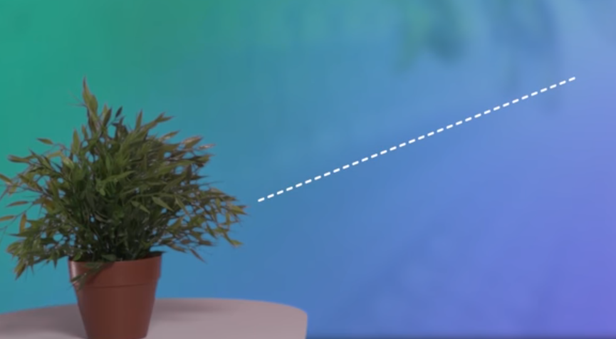
</p>

## 3.13 Log-loss Error Function

**We use these error functions to decrease the error to reach the best minimum or the global minimum which will help the function to do well on the data and get the nearest right results**

<p align="center">
    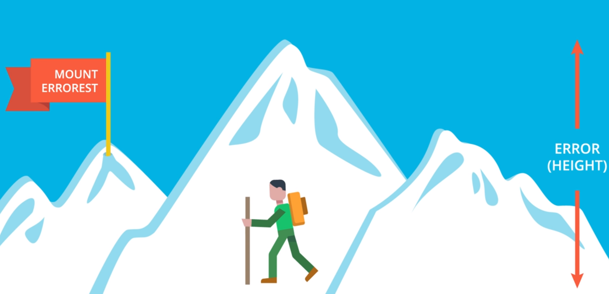
</p>

**We take so tiny steps to decrease the error and the reason for that is calculus ,because we take the derivatives to calculate it. But when we use tiny steps we cannot go further.**

<p align="center">
    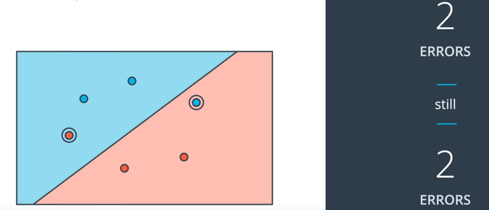
</p>

**If we try to descend from Aztec pyramid with flat steps, when we look at every dimention we found out that we cannot go down and get confused. But with mount Errorest when we look in every dimension we find very small variation in height and we can detect in what direction we can decrease the most.**

<p align="center">
    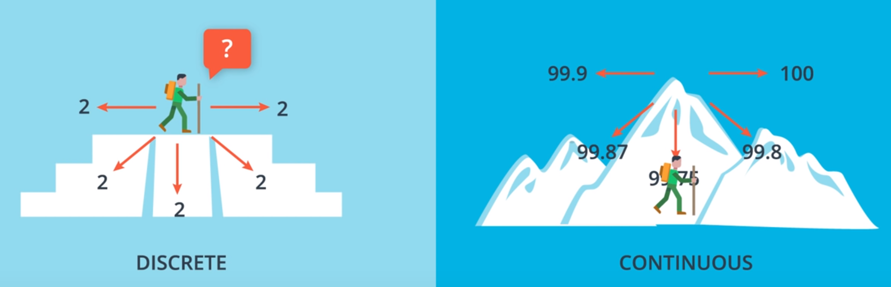
</p>

> ### Gradient Descent Terms:-
- The values should be continous.
- Error Function should differentiable.

## 3.14 Discrete vs Continous

**The predictions of disceret values will be 0,1 but for continous values will be probability as long as the probability is high it means the values in the positive area and if it low means in negative area.**

<p align="center">
    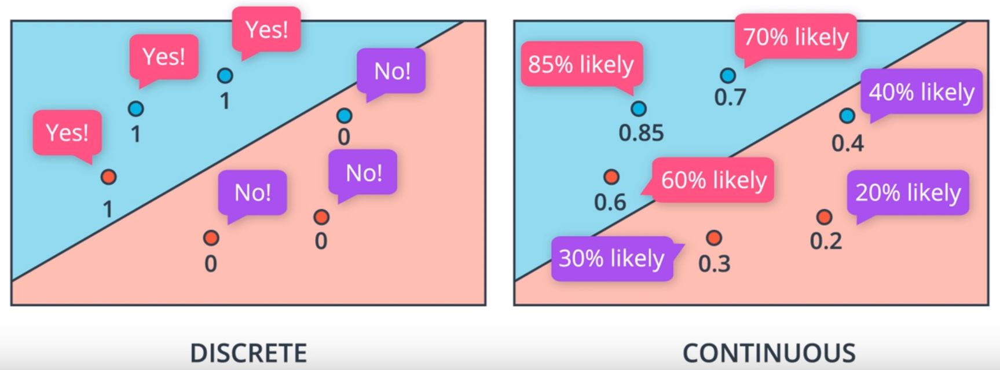
</p>

**So to move from disceret predictions to continous, change the activation function from "Step Function" to "Sigmoid Function"**

<p align="center">
    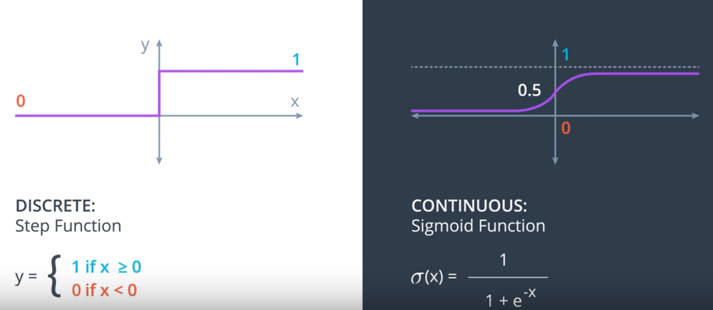
    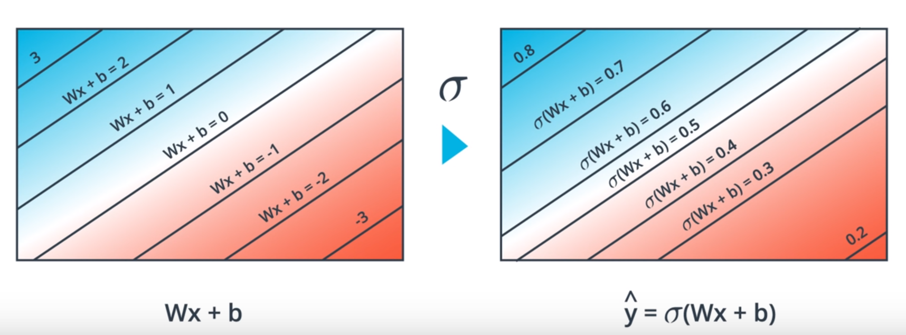
</p>

**We apply this to Neural Networks by changing the perceptron of "Step Function" to "Sigmoid Function" as New Activation Function.**

<p align="center">
    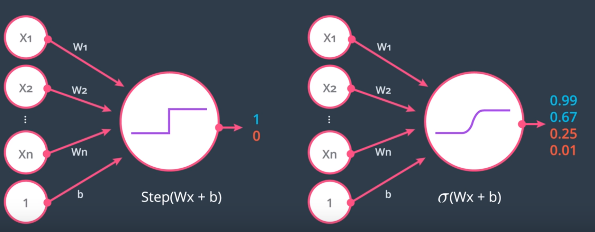
</p>

****